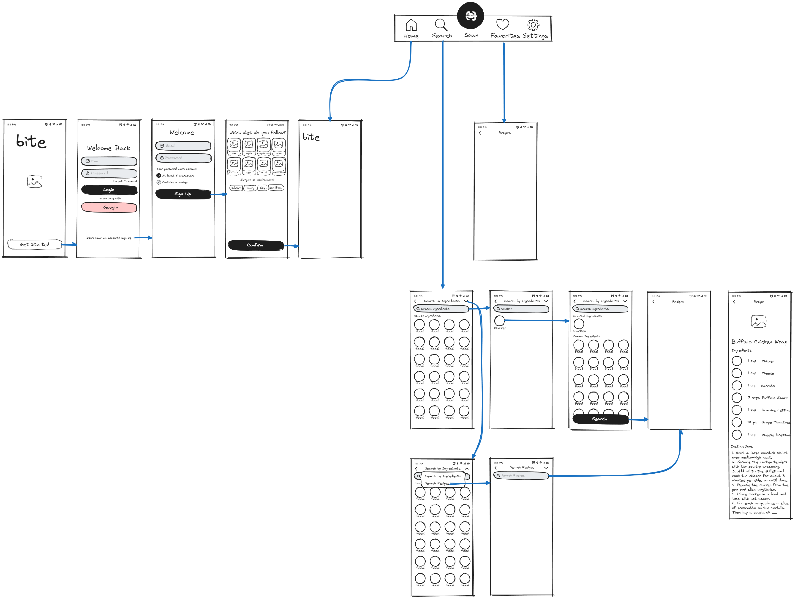
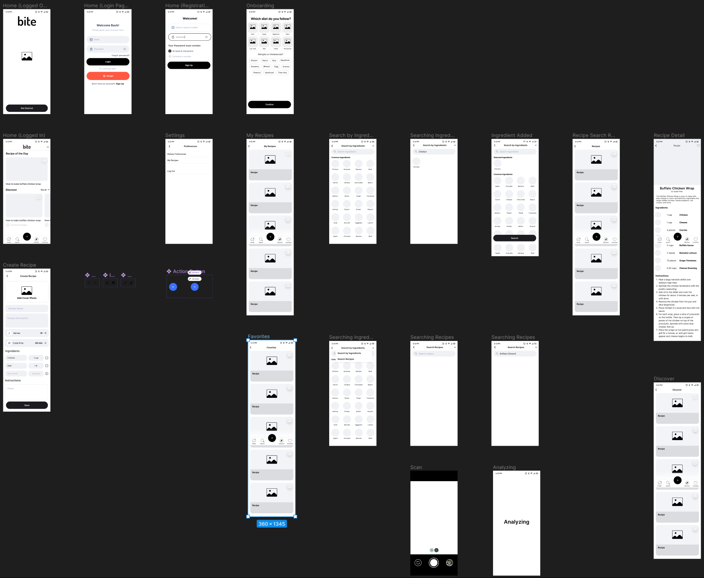
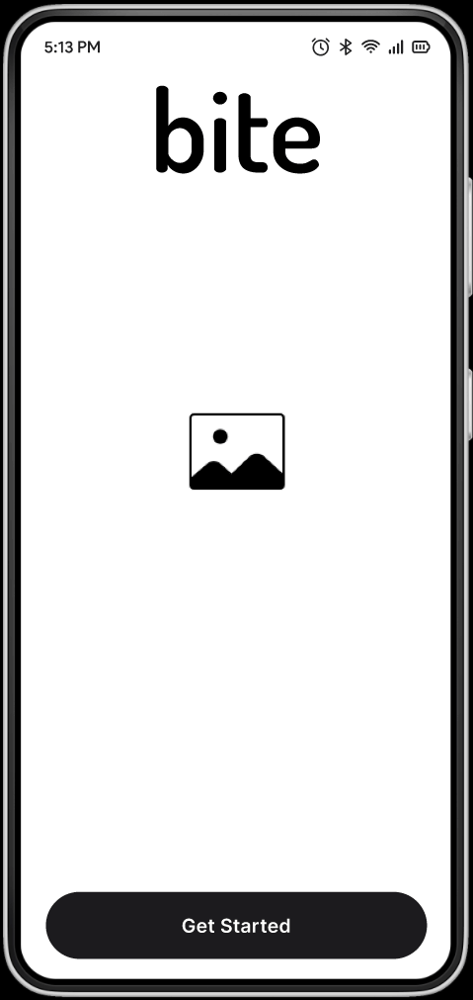
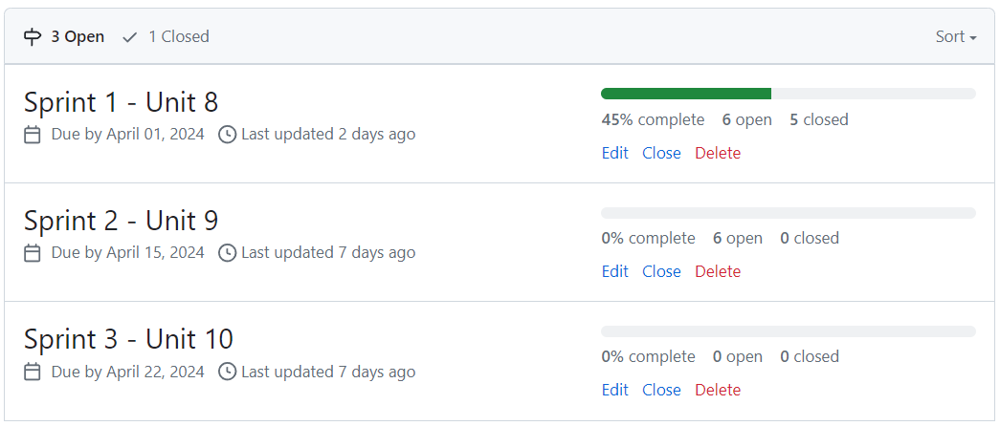
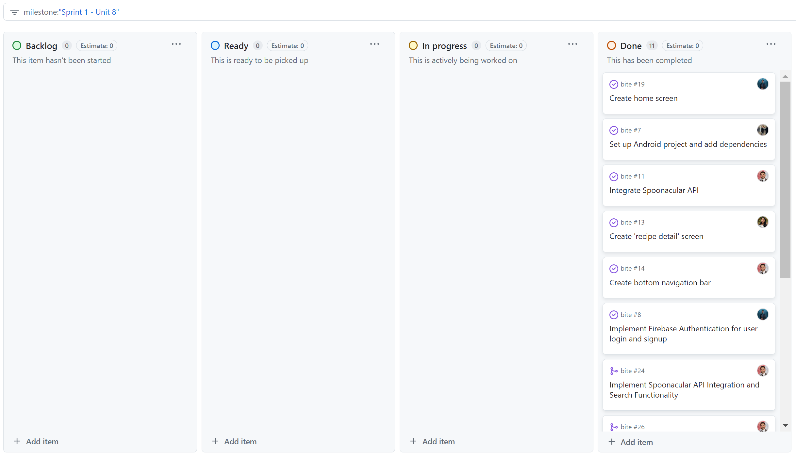
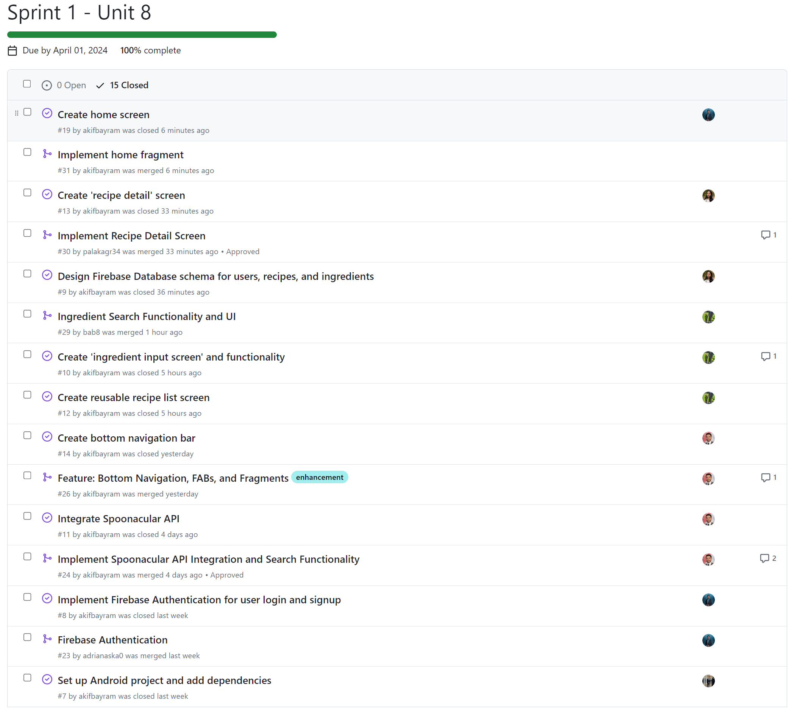
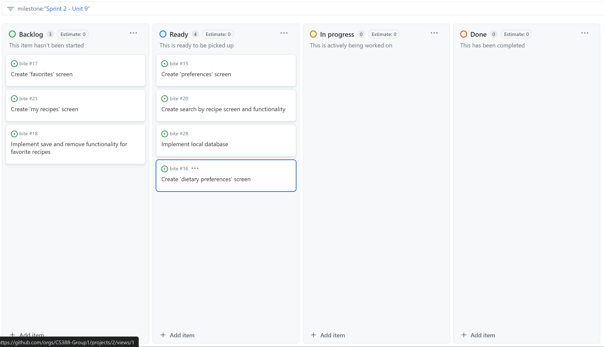
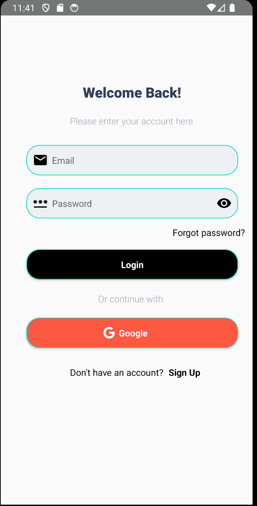
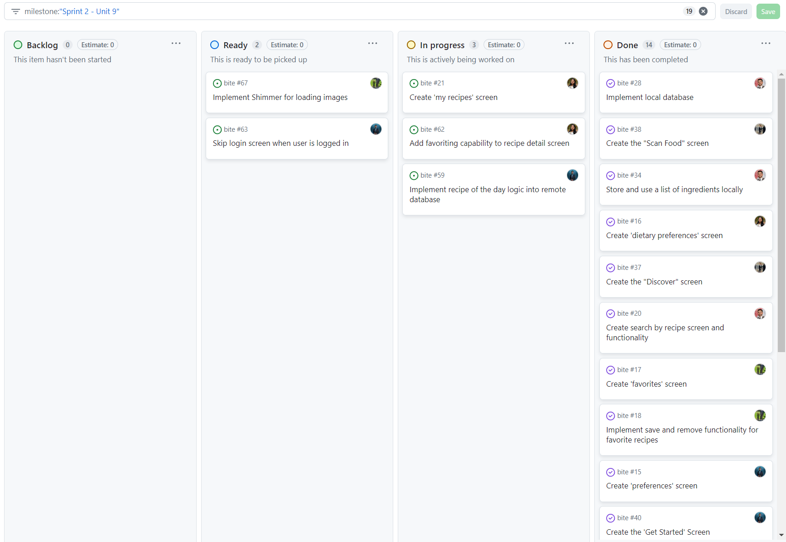
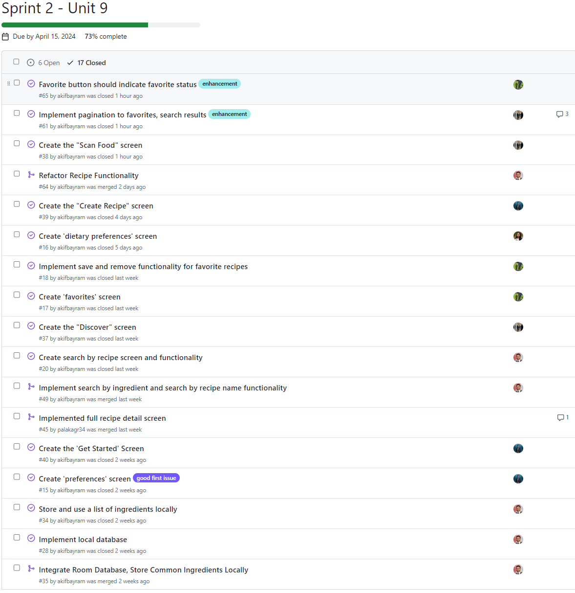

# Milestone 1 - Bite (Unit 7)

## Table of Contents

1. [Overview](#Overview)
1. [Product Spec](#Product-Spec)
1. [Wireframes](#Wireframes)

## Overview

### Description

Bite is an app that helps users discover recipes based on the ingredients they have available. By inputting the ingredients they have on hand or scanning their food using the Spoonacular image classification API, users can quickly find recipe options that suit their needs. The app also allows users to save their dietary preferences, create and manage their own recipes, and discover trending recipes.

### App Evaluation

- **Category:** Food & Drink, Recipe Discovery
- **Mobile:** Mobile devices provide a convenient way for users to find recipes on the go using their available ingredients. 
- **Story:** The app solves the common problem of having ingredients but not knowing what to cook. It provides a quick and easy way for users to discover new recipes and make the most of the ingredients they have, reducing food waste and encouraging creativity.
- **Market:** The target market for this app is broad, as it appeals to anyone who cooks, from beginners to experienced home cooks. It could be particularly useful for students, busy professionals, and anyone looking to save time and money on grocery shopping. Monetization strategies for future iterations include partnering with grocery stores for ingredient delivery, offering premium features for a subscription fee, or incorporating affiliate marketing for kitchen tools and appliances.
- **Habit:** Users would typically engage with the app several times a week, depending on how often they cook. 
- **Scope:** The development of the Bite app could be broken down into the following versions:
V1: Core functionality of ingredient input, recipe search, and basic user preferences. This version would be suitable for initial testing and user feedback.
V2: Introduction of the Favorites feature, allowing users to save and organize their preferred recipes. Enhanced user preferences, including dietary restrictions and allergies.
V3: Addition of the Discover feature, providing personalized recipe recommendations based on user preferences and popular trends. Integration with social media platforms for recipe sharing.
V4: Partnership with grocery stores for ingredient delivery, premium subscription features, and integration with smart kitchen appliances for a seamless cooking experience.

## Product Spec

### 1. User Features (Required and Optional)

**Required Features**

1. User can input available ingredients
2. User can search for recipes based on input ingredients
3. User can view a list of recipe options
4. User can view detailed information for each recipe
5. User can save favorite recipes
6. User can discover trending recipes
7. User can scan food and find recipes for it

**Optional Features**

1. User can add a recipe
2. User has a list of their created recipes
3. User can filter recipes by cuisine, meal type, or cooking time
4. User can rate and review recipes
5. User can save dietary preferences

### 2. Screen Archetypes

* Home Screen
  * User can view trending recipes
  * User can view recipe of the day
* Search Screen
  * User can input available ingredients 
  * User can search for recipes based on input ingredients
  * User can search for recipes by name
* Recipe List Screen
  * Displays a list of recipe options based on user input and preferences
* Recipe Detail Screen
  * Shows detailed information for a selected recipe, including ingredients, instructions, and nutritional information
* Discover Screen
  * Suggests new recipes based on user preferences and popular items
* Scan Food Screen
  * Allows user to scan food items and find recipes for them
* Create Recipe Screen
  * Allows user to add a new recipe
* My Recipes Screen
  * Displays a list of the user's created recipes
* Discover Screen
  * Suggests new trending recipes based on user preferences
* Favorites Screen
  * Displays a list of the user's saved favorite recipes
* Settings
  * User can save dietary preferences
  * User can log out
* Dietary Preferences
  * User can save dietary preferences
* Log In
  * User can log in to their account
* Sign Up
  * User can create a new account

### 3. Navigation

**Tab Navigation** (Tab to Screen)

* Home
* Search 
* Scan Food (accessed via + button)
* Create Recipe (accessed via + button) (optional)
* Discover 
* Favorites

**Flow Navigation** (Screen to Screen)

* Log In
  * => Home
* Sign Up 
  * => Home
* Home
  * => Recipe Detail (recipe of the day, trending recipes)
  * => Settings
    * => Dietary Preferences (optional)
    * => My Recipes (optional)
    * => Log Out
* Scan Food (scan food item)
  * => Recipe List (matching search results)
* Create Recipe (add recipe) (optional)
  * => My Recipes (list of all created recipes) (optional)
* Search (by ingredients or recipe name)
  * => Recipe List (search results)
* Recipe List (list of recipes)
  * => Recipe Detail
* Discover
  * => Recipe Detail
* Favorites (save recipe)
  * => Recipe Detail

## Wireframes

 

 

### [BONUS] Digital Wireframes & Mockups

[https://www.figma.com/file/ZElKva705TDTAHHQwN6J5o/CS388_Group](https://www.figma.com/file/ZElKva705TDTAHHQwN6J5o/CS388_Group)

### [BONUS] Interactive Prototype

[https://www.figma.com/file/ZElKva705TDTAHHQwN6J5o/CS388_Group](https://www.figma.com/file/ZElKva705TDTAHHQwN6J5o/CS388_Group)

 

# Milestone 2 - Build Sprint 1 (Unit 8)

## GitHub Project board

## Issue cards
### Sprint 1:

### Sprint 2:

## Issues worked on this sprint

- Set up Android project and add dependencies
- Implement Firebase Authentication for user login and signup
- Integrate Spoonacular API
- Design Firebase Database schema for users, recipes, and ingredients
- Create bottom navigation bar
- Create home fragment
- Create search by ingredients screen
- Create recipe detail screen
- Create reusable recipe list scree

 

# Milestone 3 - Build Sprint 2 (Unit 9)

## GitHub Project board

### Closed Issues

## Completed user stories

**Required Features**

- [x] User can input available ingredients
- [x] User can search for recipes based on input ingredients
- [x] User can view a list of recipe options
- [x] User can view detailed information for each recipe
- [x] User can save favorite recipes
- [x] User can discover trending recipes
- [x] User can scan food and find recipes for it

**Optional Features**

- [x] User can add a recipe
- [ ] User has a list of their created recipes
- [ ] ~~User can filter recipes by cuisine, meal type, or cooking time~~
- [ ] ~~User can rate and review recipes~~
- [x] User can save dietary preferences

### Build Progress

## App Demo Video

- Embed the YouTube/Vimeo link of your Completed Demo Day prep video